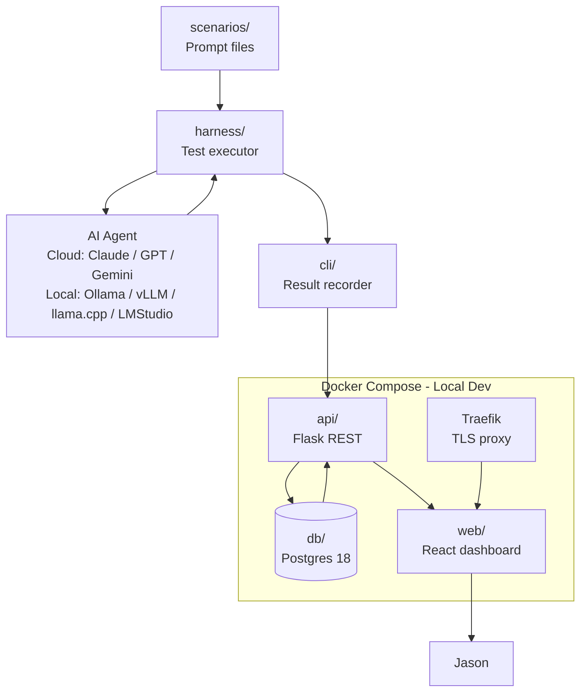

# Project Architecture

## Overview

Agent Testbench is a monorepo with six modules. The harness drives scenario execution against AI agents, the CLI records results via the API, and the web dashboard displays metrics from the database.

## Module Layout

```
agent-testbench/
├── scenarios/   # Structured prompt files for AI agent stress tests
├── api/         # Python 3.14 / Flask REST API
├── web/         # TypeScript / React dashboard (Node 24 LTS + Express)
├── cli/         # CLI tool for recording test results (invoked by harness)
├── harness/     # Test execution engine (likely OpenCode-based)
└── db/          # Postgres 18 schema, migrations, seed data
```

## System Diagram



## Components

- **scenarios/** — The test library. Each scenario is a Markdown file with YAML front matter (`name`, `category`, `difficulty`, `description`, `tags`) and a prompt as the body. New scenarios can be added as files without code changes. Example:

  ```markdown
  ---
  name: code-refactor-large
  category: coding
  difficulty: hard
  type: agent        # agent = via OpenCode; model = direct API
  description: Tests ability to refactor a large, messy module
  tags: [refactor, python, large-context]
  ---

  Refactor the following Python module...
  ```
- **harness/** — Executes scenarios against target AI agents and invokes the CLI to record results. Branches on the scenario's `type` field:
  - **`type: agent` (OpenCode path):** `opencode run --format json` via Python subprocess. The harness generates a temporary `opencode.json` in a per-run `tempfile.TemporaryDirectory` with `"permission": {"*": "allow"}` and the target model as the provider config. OpenCode supports local models (Ollama, LM Studio, vLLM) as providers, so all models go through the same OpenCode overhead — fair comparison. Multi-turn uses `--session $ID --continue` with the session ID captured from the first event.
  - **`type: model` (direct API path):** All models (local and cloud) called via OpenAI-compatible API. No agent overhead. Measures raw speed and quality. Parse `usage` object for token counts; use response timing for throughput.
  - **Stall handling:** output-heartbeat watchdog (90 s silence = stall), hard wall-clock timeout (10 min), repetition detection (3× identical tool calls = loop), max-turn cap per scenario. Recovery: retry with clarifying prompt up to N times, then record `error`.
- **cli/** — Accepts structured run data (from the harness) and posts it to the API. Designed to be composed into shell pipelines or scripted execution.
- **api/** — Flask REST API. Receives run records from the CLI, validates and persists them to Postgres, and serves data to the web dashboard.
- **web/** — React dashboard for browsing, filtering, and comparing test run metrics across runs, scenarios, and models.
- **db/** — Postgres 18 schema and migration scripts. Local instance runs in Docker Compose; dev / stage / prod connect to dedicated Postgres VMs.

## Data Flow

1. Jason runs the harness with a chosen scenario and target AI agent.
2. The harness executes the scenario prompt(s), tracks metrics (time, tokens, turns), and invokes the CLI with the result.
3. The CLI posts the run record to the API.
4. The API validates and writes the record to Postgres.
5. Jason reviews and compares results in the React web dashboard.

## Deployment

- **Local dev:** Docker Compose runs api, web, db, and Traefik as a single stack. Traefik terminates TLS for the web client.
- **Dev / Stage / Prod:** API and web deploy to dedicated VMs; DB connects to the corresponding dedicated Postgres 18 VM for that environment.

## Decisions

- Traefik handles TLS termination for the web client in all environments (not just prod).
- uv manages Python environments for api, cli, and harness — all three share a Python 3.14 baseline.
- Scenario files are the source of truth for test definitions; the harness discovers them from the filesystem.
- CLI → API → DB (not CLI → DB directly) — the API is the single write path for run records, keeping schema changes in one place.
